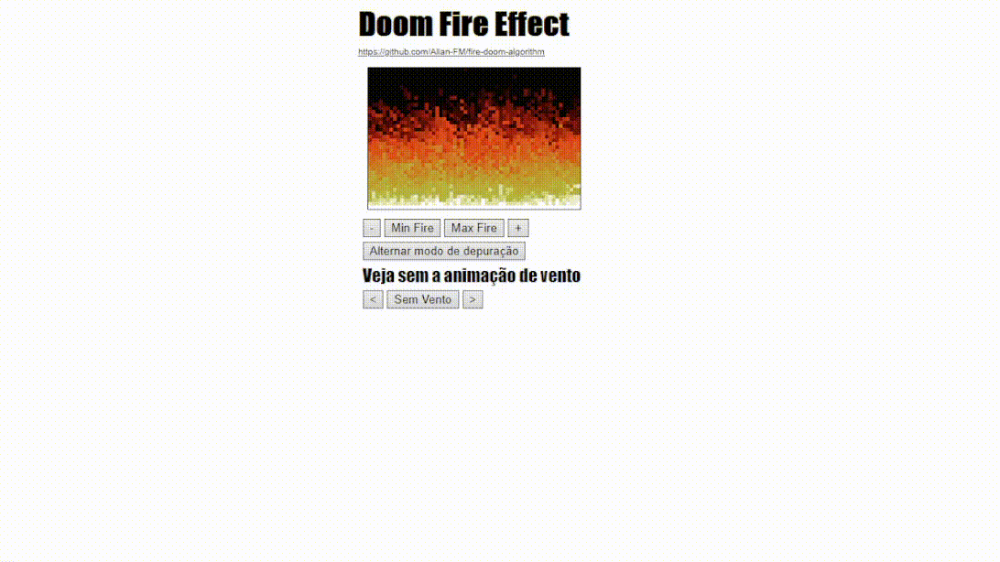

# fire-doom-algorithm
<h1>DOOM game fire effect in JavaScript<h1>
The doom fire algorithm is divided into three parts: The data structure, the algorithm and the rendering.
-----------------------------------------------------

    
  </a>

    
  </a>

