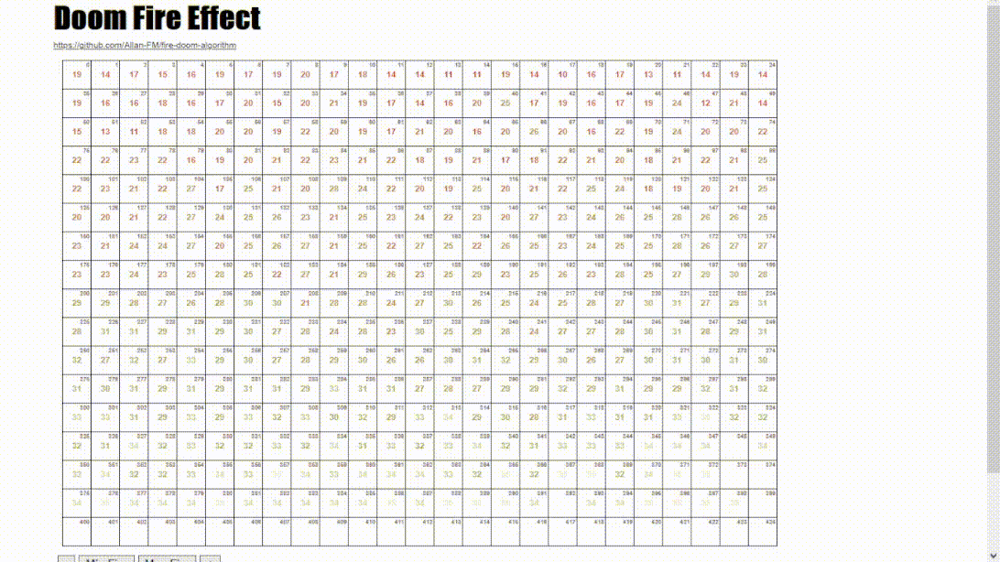

# fire-doom-algorithm
<h1>Efeito do fogo do jogo DOOM em JavaScript<h1>

O algoritimo do fogo do doom é dividido em Tres partes: A estrutura de dados, o algoritmo e a renderização.

-----------------------------------------------------

    
  </a>

    
  </a>

